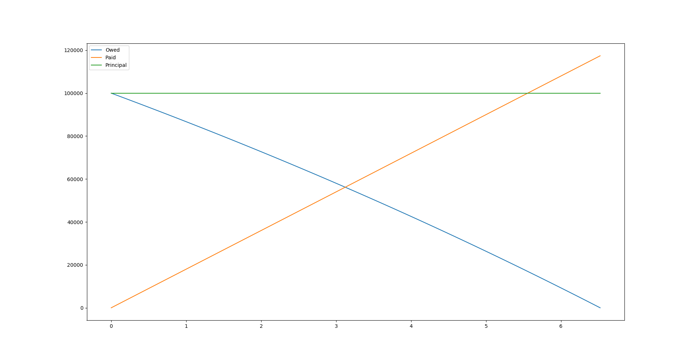

# Debt Tools

This repo contains python scripts for managing compound interest and tracking
debt.
The `math.tex` and `math.pdf` files give a brief overview of the mathematics
behind these tools.

## `compute_payments.py`

This tool calculates how much one needs to pay each period to pay off all debts
in a certain number of years.
For instance to compute how much one needs to pay for a $100,000 monthly
mortgage at a 5% interest rate in 20 years run

```
> ./compute_payments.py 100000 0.05 12 20
Should pay 659.96 to pay debt off in 20.00 years.
Total paid is 158389.38, which is a 58.39% return on investment for lender.

Minimum payment needed to maintain current debt is 416.67.
Recommended minimum payment is 485.47 for 39.16 years for a total of 228122.88 (128.12% return).
```

This program gives the amount needed to meet one's target payoff period, the
total that will be paid, and how much the investor can expect in return.
Additionally, it will give the minimum payment needed to not increase debt, as
well as a recommended minimum payment (this is approximately how much one needs
to pay to make headway in paying off debt).

## `compound_interest.py`

This tool computes statistics given a set payment plan.
For example, taking the above mortgage we could decide to pay $1,500 a month.
The tool can be ran as

```
> python compound_interest.py 100000 0.05 12 1500
Will take 6.52 years to pay off.
Total paid is 117395.96, which is a 17.40% return on investment for lender.
```

This again gives how long it will take to pay off the debt, how much in total
will be paid, and the return on investment it gives the lender.

Passing the `--graph` option gives a graph like so


# Contributions

For code contributions please open a pull request.
If you find a bug or a mistake in my math please open an issue.
Thanks!
