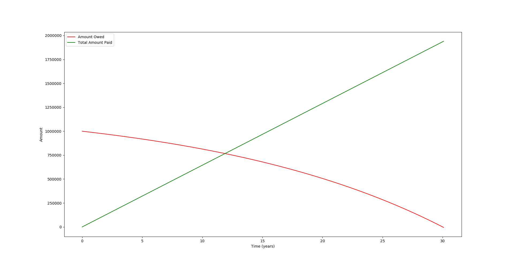
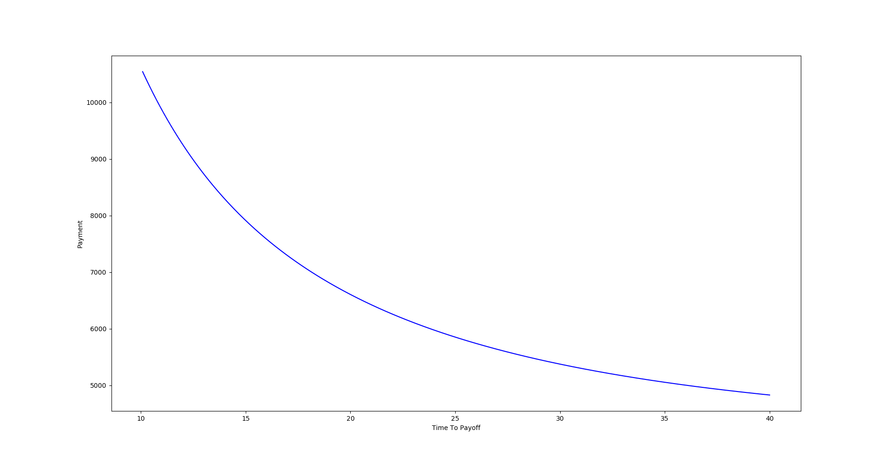

# Debt Tools

This repo contains python scripts for managing compound interest and tracking
debt.
The `math.tex` and `math.pdf` files give a brief overview of the mathematics
behind these tools.

## Usage

This debt tool can be used in two ways.
The first is that given an unknown among the principal, payment, and time to pay
all debt, it can compute that unknown.
For example, given a $1,000,000 mortgage at 5% APR compounded daily and paid
monthly for 30 years, the borrower can compute the monthly payment as follows.

```
> ./debtTool.py 0.05 365 12 -P 1000000 -t 30
Interest: 0.05
Compound Frequency: 365.00
Payment Frequency: 12.00
Principal: 1000000.00
Payment: 5374.38
Minimum Payment 4175.07
Time to Payoff: 30.00
Total Paid: 1934777.82
Return on Investment: 93.48%
```

From this we can gather that the borrower must pay $5,374.38 per month.
Passing `--recommended` will also give a recommended payment plan.
Passing `--graph-timeline` will plot a payment time line (see below).


The second function occurs when there are two unknowns and the
`--graph-tradeoff` option is given.
For example, suppose we didn't give the 30 year period and instead invoked

```
> ./debtTool.py 0.05 365 12 -P 1000000 --graph-tradeoff 10 40
```

This would create the following graph


## Financial Advise

**This is non-expert advise and as such the maintainers of this repo are not
liable for any actions taken because of it.**

By experimenting with different values we can see several trends that lead to
some interesting financial advise.

1. Be wary of high interest rates.
   The monthly payment needed is directly proportional to the interest rate.
2. If low monthly payments are the main concern than pay twice the absolute
   minimum.
   This will minimize payments while also making significant headway towards
   paying of the debt.
3. If one must lower their payments, they should increase the time they will
   take to pay it off and calculate how much they need to pay, instead of simply
   decreasing the amount they will pay.
   This is because increasing time can significantly bring payments closer to
   their minimum, while the opposite is true for decreasing payments.
   Thus, increasing time will give a better trade off between time and amount
   paid.

## Contributions

For code contributions please open a pull request.
If you find a bug or a mistake in my math please open an issue.
Thanks!
