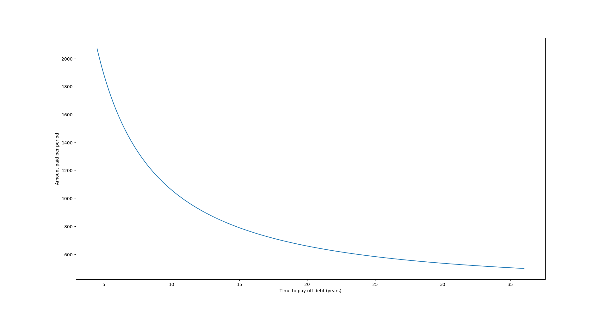
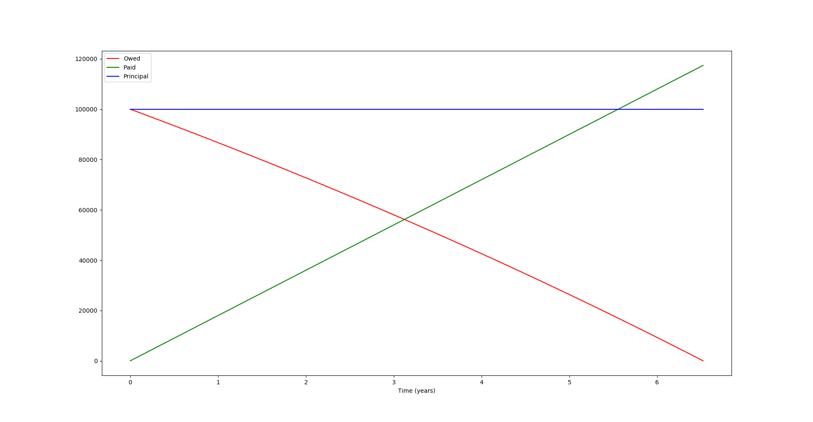

# Debt Tools

This repo contains python scripts for managing compound interest and tracking
debt.
The `math.tex` and `math.pdf` files give a brief overview of the mathematics
behind these tools.

## `compute_payments.py`

This tool calculates how much one needs to pay each period to pay off all debts
in a certain number of years.
For instance to compute how much one needs to pay for a $100,000 monthly
mortgage at a 5% interest rate in 20 years run

```
> ./compute_payments.py 100000 0.05 12 -t 20
Should pay 659.96 to pay debt off in 20.00 years.
Total paid is 158389.38, which is a 58.39% return on investment for lender.

Minimum payment needed to maintain current debt is 416.67.
Recommended minimum payment is 833.33 for 13.89 years for a total of 138918.05 (38.92% return).
```

If instead one wishes to know how much they need to pay for the total payments
to add up to $120,000, then they can run

```
> ./compute_payments.py 100000 0.05 12 -a 120000
Should pay 1341.28 to pay debt off in 7.46 years.
Total paid is 120000.00, which is a 20.00% return on investment for lender.

Minimum payment needed to maintain current debt is 416.67.
Recommended minimum payment is 833.33 for 13.89 years for a total of 138918.05 (38.92% return).
```

For just the recommended arguments run without flags.
```
> ./compute_payments.py 100000 0.05 12
Minimum payment needed to maintain current debt is 416.67.
Recommended minimum payment is 833.33 for 13.89 years for a total of 138918.05 (38.92% return).
```

This program gives the amount needed to meet one's target payoff period/amount,
the total that will be paid, and how much the investor can expect in return.
Additionally, it will give the minimum payment needed to not increase debt, as
well as a recommended minimum payment.
The recommended minimum payment is approximately how much one needs to pay so
that a $1 increase in the principal results in an increase of the total amount
paid by $2 (this can be changed with the `--delta` flag).
This value is double the minimum payment needed to maintain debt.
Please note this **does not** mean that the total amount paid is twice the
principal, given monthly payments it ranges from 38.63% to 44.33% returns for
the investor.

A graph of time to payoff debts versus amount paid can also be shown with the
`--graph` option.
An example graph is


## `compound_interest.py`

This tool computes statistics given a set payment plan.
For example, taking the above mortgage we could decide to pay $1,500 a month.
The tool can be ran as

```
> ./compound_interest.py 100000 0.05 12 1500
Will take 6.52 years to pay off.
Total paid is 117395.96, which is a 17.40% return on investment for lender.
```

This again gives how long it will take to pay off the debt, how much in total
will be paid, and the return on investment it gives the lender.

Passing the `--graph` option gives a graph like so


## Financial Advise

**This is non-expert advise and as such the maintainers of this repo are not
liable for any actions taken because of it.**

By experimenting with different values we can see several trends that lead to
some interesting financial advise.

1. Be wary of high interest rates.
   The monthly payment needed is directly proportional to the interest rate.
2. If low monthly payments are the main concern than pay twice the absolute
   minimum.
   This will minimize payments while also making significant headway towards
   paying of the debt.
3. If one must lower their payments, they should increase the time they will
   take to pay it off and calculate how much they need to pay, instead of simply
   decreasing the amount they will pay.
   This is because increasing time can significantly bring payments closer to
   their minimum, while the opposite is true for decreasing payments.
   Thus, increasing time will give a better trade off between time and amount
   paid.

## Contributions

For code contributions please open a pull request.
If you find a bug or a mistake in my math please open an issue.
Thanks!
